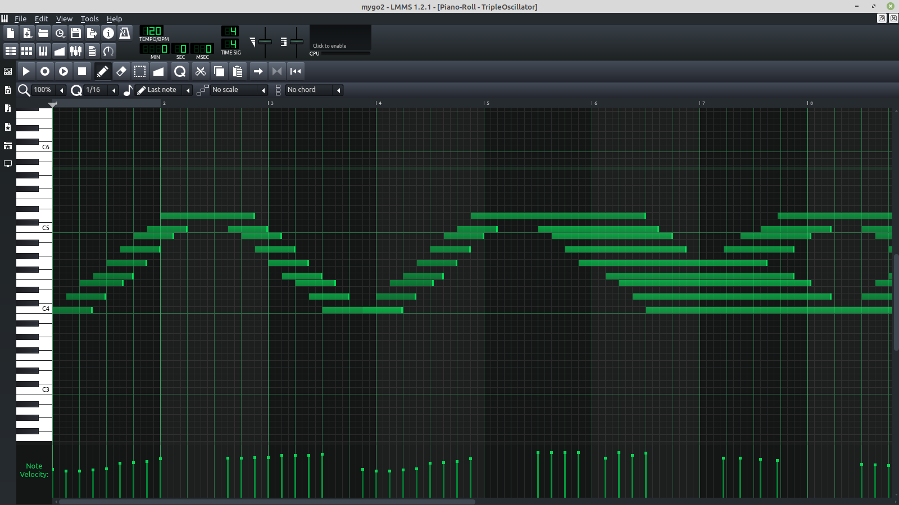

## RPi-midi-file-control-gpio

The goal of the included codes is to use a sound program to compose animation of multiple output ON/OFF control on a Raspberry Pi. <br/>
The included scripts require the module [MIDIFile](https://pypi.org/project/MIDIFile/#files) <br/>
Install using pip3:

```bash
sudo apt-get update
sudo apt-get install python3-pip
sudo pip3 install MIDIFile
```
Recommended tempo for midi file preparation is 120bpm.<br/>
The following is a visual example of LMMS music production program that I used to prepare and export a midi file:


Within this repository is included a file titled _project.mid_ ,exported from a simple piano track from LMMS. You can use this file to test the codes. For example:

```python
python3 readMidiRaw.py project.mid
```

Using the _.mid_ file as argument you should see the full list of midi commands given in that file. This code is using the MIDIFile module alone, with no further parsing.

It is necessary to examine these results, searching for several pieces of data. First and foremost is the beginning and the ending lines for the track we wish to use. The following codes may need to be modified depending on your file. In the following codes, the _startString_ and the _endString_ variables should be modified accordingly. <br/>
The index placement is equally important to look out for. The index for the time value, the key value (musical note), and the state value (ON/OFF) are to be verified and changed accordingly. The index for velocity is equally accounted for in the final code _midiToGPIO.py_ <br/>
##### Another parameter that must be considered when preparing a midi file is the notes that we will be using. If a note exists in the midi file but is not addressed in the python code, this will result in an error. The code will not work.

Running the following code will show results of further modified values:

```python
python3 parseMidiFile.py project.mid
```

After preparing a circuit with designated outputs prepared, you should be able to launch the final command:

```python
python3 midiToGPIO.py project.mid
```

If starting by using LEDs, the result should look something like this:


The pretext for this project was development of a fountain using solenoids. Prototype results can be viewed here:
[](https://www.youtube.com/watch?v=D7yVm_x9mQ0)
